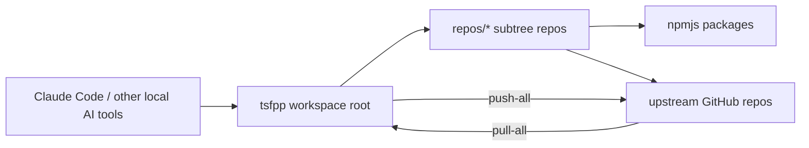

# Workspace Architecture and Rationale

This workspace is intentionally shaped as a single entry point for a family of
related npm packages and supporting repositories.

The goal is simple:

- one root clone for humans and AI tools to inspect
- one place to make coordinated changes across packages
- one repeatable way to push and pull changes back to the real upstream repos
- one dependency/versioning story that stays consistent across the whole family

## The shape of the workspace

The root repository is the control plane.

Under `repos/`, each child directory is a subtree-managed copy of an actual
GitHub repository. Those directories are not random vendored code; they are the
authoritative working copies for the individual packages.

## Why this exists

Without this workspace, the TSF++ family is hard to reason about because the
system is split across many repos:

- some packages publish to npmjs.com
- some packages depend on sibling packages
- some repos contain AI instructions, skills, or prompts that need to stay in
  sync with the package APIs
- version bumps in one package can force version bumps in several others

The root workspace gives us a single place to see the whole graph.
That matters for both humans and AI systems:

- humans can inspect the full family in one clone instead of hopping between
  repositories
- AI can read the full context before editing, which is important when symbols,
  file names, or package versions must change together
- the workspace makes coordinated changes less error-prone because the sibling
  package references are visible at once

## Subtree model

Each directory under `repos/` is tracked by Git subtree.

That means:

- the root repo stores the subtree contents as ordinary tracked files
- the root repo can be committed normally
- changes can later be pushed back to the upstream child repository with
  `scripts/push-all.sh`
- upstream changes can be pulled into the workspace with `scripts/pull-all.sh`

The important distinction is that the workspace is a convenience and control
layer, not a replacement for the child repos.

The child repositories still exist independently and still need their own
release/version discipline.

## Workflow

### Read and edit locally

Open only the root repository in Claude Code or a similar local agent.
Then work inside the subtree directories under `repos/`.

This allows the assistant to see the entire package family while still editing
the individual repos in place.

### Sync in

Use `scripts/pull-all.sh` when upstream repos have moved ahead.

That script brings the latest child-repo commits into the root workspace so the
workspace remains a faithful mirror of upstream reality.

### Commit in the root

Make changes in the root workspace and commit there first.

That root commit becomes the single reviewed unit of change.

### Push out to each repo

Use `scripts/push-all.sh` after the root commit is ready.

It pushes the committed subtree changes back to each child repository’s own
`main` branch.

This is the step that turns a workspace commit into real repository updates.

## Authentication model

The workspace root may use a different GitHub account or SSH key than the child
repositories.

That is deliberate.

The root repo is the coordination point for the workspace. The child repos are
the publishable projects. Keeping those auth contexts separate avoids accidental
pushes with the wrong identity and makes it possible to work on the whole family
from one clone while still respecting each repo’s remote ownership.

The scripts handle this by pushing each subtree to the correct remote. In other
words, you do not manually re-clone every child repo just to update it.

## Versioning rules

This workspace has a dependency graph, so versioning is not just a publish
detail; it is part of the architecture.

The general rule is:

- bump the package that changed
- bump any sibling package that consumes the new version range
- update release manifests so release-please and npm publish agree
- update changelogs so the human history matches the package metadata

This is especially important when a package publishes to npm and another
package depends on it locally.

If a package publishes a new version, the following may also need to move:

- sibling package.json dependency ranges
- pnpm workspace policy files that pin new internal releases
- release-please manifest entries
- changelog version headers

The workspace exists partly so those coupled changes can be edited together.

## Publish order and release-age policy

Publishing in this workspace is not only about semver and dependency ranges.
It is also constrained by pnpm supply-chain policy.

Several package repos use `pnpm-workspace.yaml` to enforce a minimum release age
for dependencies. That means a package can fail `npm publish` or even
`npm publish --dry-run` if one of its dependencies was published too recently,
even when the version exists on npm already.

In practice, this means the publish workflow has two checks:

- is the required sibling version already published?
- is that published version allowed by the local `minimumReleaseAge` policy?

For internal TSF++ releases, the policy exceptions belong in the package repo's
own `pnpm-workspace.yaml`.

The important operational detail is that `minimumReleaseAgeExclude` should be
documented and maintained carefully. In this workspace, package-name exclusions
are the safer default for freshly published internal packages because they cover
all resolved variants of that package during lockfile verification.

Example:

- `@tsfpp/prelude` may be published successfully
- `@tsfpp/boundary` may still fail publish checks immediately afterward
- the fix is not another version bump, but updating the local
  `minimumReleaseAgeExclude` entries so pnpm allows the just-published internal
  package through the verification step

This is part of the release choreography, not an incidental local-machine
problem.

## Publish order matters

Because several packages depend on newly published sibling versions, release
order matters.

The general rule is:

- publish foundational packages before dependents
- then rebuild lockfiles and publish checks in the dependents
- only publish a dependent package after both npm availability and local
  release-age policy allow the new graph

For example, if `boundary` depends on `prelude@2.0.2`, then publishing
`agents` first does not unblock `boundary`. `boundary` remains blocked until
`prelude@2.0.2` is published and accepted by the local pnpm policy.

So the dependency graph does not only determine version bumps; it also
determines release order.

## Why version bumps sometimes cascade

Several TSF++ packages depend on one another.

For example:

- `eslint-config` influences the linting setup used by other packages
- `prelude` and `boundary` consume shared conventions and can reference each
  other through package versions
- `mcp-server` depends on the published packages that expose the standards and
  runtime helpers

When one package gets republished, the others may need a new version even if
their runtime code did not change much, because their dependency metadata did.

That is not churn for its own sake.
It is how we keep the published graph honest.

If the dependency ranges are wrong, publish-time checks fail, local peers drift,
or the next release is no longer reproducible from the workspace state.

## Human and AI interpretation

### For humans

Think of the root repo as a control room with a map of all the packages.

The individual package repos are still real repos, but the workspace lets you
change them together without losing sight of the bigger picture.

### For AI systems

The workspace provides the full context needed to make safe multi-repo edits:

- read the root first
- understand which subtree owns which package
- update package versions and downstream references together
- use the push/pull scripts rather than inventing ad hoc repo-by-repo flows
- respect the auth and remote boundaries when publishing changes back out

That reduces the chance that the model updates a package version without also
updating the consumers, release manifest, or publish metadata.

## Practical rule of thumb

When you change one package, always ask:

1. Does this package publish to npm?
2. Do sibling packages reference its version range?
3. Does its release manifest need to move?
4. Does the changelog need a new version section?
5. Does `scripts/push-all.sh` need to carry the root commit back out to the
   child repos?

If the answer to any of those is yes, the change is not finished until the
graph is updated end to end.

## Bottom line

This workspace is a single point of entry for a distributed package family.
It exists so the whole system can be understood, edited, versioned, and pushed
consistently from one clone while still preserving the identity and release
history of each child repository.