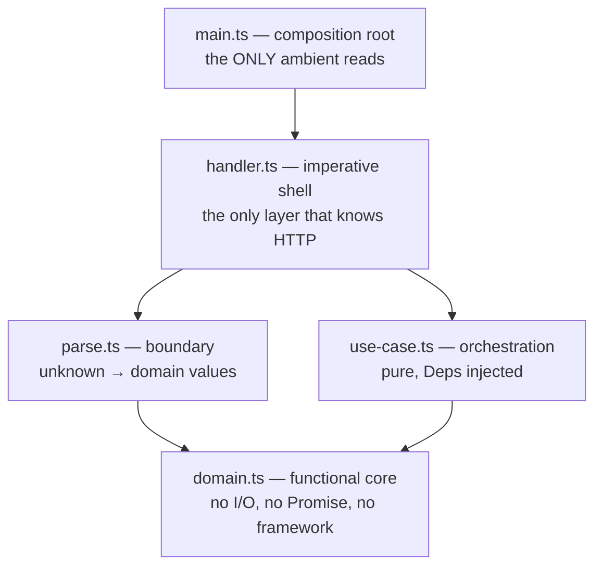

# Reference service — a complete TSF++ vertical slice

Every other file in `spec/examples/` shows one section in isolation. This one
shows the whole standard working together on a single feature: a subscription
signup endpoint, from untrusted HTTP body to typed response.

It exists because the fragments do not answer the question people actually have
— *what does a whole TSF++ program look like, and where does each rule land?*

> **This code is verified.** Every block below was type-checked against
> `@tsfpp/prelude` 2.2.0 under the mandatory `tsconfig` of Rule 9.1, compiled,
> and executed. The output in [What it proves](#what-it-proves) is real program
> output, not an illustration.

---

## The shape



Dependencies point **inward only**. The core does not know a boundary exists;
the boundary does not know a transport exists. That one-way rule is what makes
the core provable and the shell replaceable.

---

## 1. The functional core

Illegal states are unrepresentable before any logic runs: identity is branded
(Rule 1.3), the seat count is a refined numeric that cannot be `NaN`
(Rule 1.13), the lifecycle is a sum type rather than boolean flags (Rule 1.1),
and the error channel is a `kind`-tagged union so every recovery site can be
exhaustive (Rule 6.7).

```typescript
/**
 * @module domain — the functional core.
 *
 * Zero I/O, zero framework imports, zero `Promise`. Everything here is a value
 * or a total function over values. This is the layer the compiler can prove.
 */
import {
  type Brand, type Option, type Positive,
  mkPositive, none, some,
} from '@tsfpp/prelude';

/** Rule 1.3 — nominal identity, constructed only through a smart constructor. */
export type CustomerId = Brand<string, 'CustomerId'>;
export type EmailAddress = Brand<string, 'EmailAddress'>;

/** Rule 1.13 — a constrained numeric, not a bare `number`. */
export type SeatCount = Positive;

/**
 * Rule 6.7 — the error channel is a `kind`-tagged union, so every recovery site
 * can be exhaustive and a new variant becomes a compile error at each of them.
 */
export type SignupError =
  | { readonly kind: 'field_missing'; readonly field: string }
  | { readonly kind: 'email_malformed'; readonly raw: string }
  | { readonly kind: 'seats_invalid'; readonly raw: number }
  | { readonly kind: 'customer_unknown'; readonly id: CustomerId }
  | { readonly kind: 'plan_full'; readonly remaining: number };

/** Rule 1.1 — the subscription lifecycle as a sum type, not booleans. */
export type Subscription =
  | { readonly kind: 'trial'; readonly customer: CustomerId; readonly seats: SeatCount }
  | { readonly kind: 'active'; readonly customer: CustomerId; readonly seats: SeatCount; readonly startedAt: Date };

const EMAIL_RE = /^[^@\s]+@[^@\s.]+\.[^@\s]+$/;

/** Rule 7.3 — `mk` prefix; Rule 8.1 — total, partiality surfaced in `Option`. */
export const mkEmailAddress = (raw: string): Option<EmailAddress> =>
  // eslint-disable-next-line -- DEVIATION(1.6): brand applied after validation
  EMAIL_RE.test(raw) ? some(raw as EmailAddress) : none;

export const mkCustomerId = (raw: string): Option<CustomerId> =>
  // eslint-disable-next-line -- DEVIATION(1.6): brand applied after validation
  raw.length > 0 ? some(raw as CustomerId) : none;

/** Delegates to the prelude's refinement — NaN and Infinity cannot get through. */
export const mkSeatCount = (raw: number): Option<SeatCount> => mkPositive(raw);
```

---

## 2. The boundary — parse, don't validate

`unknown` is converted to domain values exactly once (Rule 8.4). The three
field checks are **independent**, so this is the place `Validation` belongs
rather than `Result`: the caller gets every bad field at once (Rule 6.8).

```typescript
/**
 * @module parse — the boundary. `unknown` in, domain values out.
 *
 * Rule 8.4: parse, don't validate — nothing downstream ever sees a raw shape.
 * Rule 6.8: these field checks are *independent*, so failures accumulate. The
 * caller learns about every bad field at once, which is what an RFC 9457
 * `errors` array promises and a `Result` pipeline structurally cannot deliver.
 */
import {
  type Option, type UnknownRecord, type Validation,
  getNumberField, getStringField, invalid, isSome,
  sequenceStructValidation, valid,
} from '@tsfpp/prelude';
import {
  type CustomerId, type EmailAddress, type SeatCount, type SignupError,
  mkCustomerId, mkEmailAddress, mkSeatCount,
} from './domain.js';

export type SignupRequest = {
  readonly customer: CustomerId;
  readonly email: EmailAddress;
  readonly seats: SeatCount;
};

/** Turns an absent `Option` into a tagged failure — one check, one error. */
const required = <A>(value: Option<A>, onMissing: SignupError): Validation<SignupError, A> =>
  isSome(value) ? valid(value.value) : invalid(onMissing);

const parseEmail = (raw: UnknownRecord): Validation<SignupError, EmailAddress> => {
  const text = getStringField(raw, 'email');
  if (!isSome(text)) return invalid({ kind: 'field_missing', field: 'email' });
  return required(mkEmailAddress(text.value), { kind: 'email_malformed', raw: text.value });
};

const parseCustomer = (raw: UnknownRecord): Validation<SignupError, CustomerId> => {
  const text = getStringField(raw, 'customerId');
  if (!isSome(text)) return invalid({ kind: 'field_missing', field: 'customerId' });
  return required(mkCustomerId(text.value), { kind: 'field_missing', field: 'customerId' });
};

const parseSeats = (raw: UnknownRecord): Validation<SignupError, SeatCount> => {
  const n = getNumberField(raw, 'seats');
  if (!isSome(n)) return invalid({ kind: 'field_missing', field: 'seats' });
  return required(mkSeatCount(n.value), { kind: 'seats_invalid', raw: n.value });
};

/**
 * Every field is checked; every failure is reported.
 * `sequenceStructValidation` yields the typed struct or the full error list.
 */
export const parseSignup = (raw: UnknownRecord): Validation<SignupError, SignupRequest> =>
  sequenceStructValidation({
    customer: parseCustomer(raw),
    email: parseEmail(raw),
    seats: parseSeats(raw),
  });
```

---

## 3. The use case — sequential steps, injected effects

Note the contrast with the previous file. Here each step *depends* on the one
before, so short-circuiting is correct and `Result` is the right ADT. And the
clock arrives in `Deps` (Rule 4.6) — which is the only reason the frozen-clock
test below needs no mocking framework.

```typescript
/**
 * @module use-case — orchestration. Still pure; still no imports from a framework.
 *
 * Rule 4.6: the clock is an *effect*, so it arrives in `Deps` rather than being
 * read from the ambient environment. That is the entire reason this function is
 * testable with a frozen clock and no mocking framework.
 * Rule 6.4: the repository port returns `Promise<Result<…>>` — failure is a
 * value in the success channel, never a rejection.
 */
import {
  type Result, type Option,
  err, flatMap, isErr, isSome, ok,
} from '@tsfpp/prelude';
import type { CustomerId, SeatCount, SignupError, Subscription } from './domain.js';
import type { SignupRequest } from './parse.js';

/** The port the domain defines and the infrastructure implements (Rule 6.5). */
export type CustomerRepo = {
  readonly findCustomer: (id: CustomerId) => Promise<Result<Option<CustomerId>, SignupError>>;
  readonly remainingSeats: () => Promise<Result<number, SignupError>>;
};

/** Everything ambient, made explicit. Tests pass a frozen clock. */
export type Deps = {
  readonly repo: CustomerRepo;
  readonly now: () => Date;
};

/** Pure decision, extracted so it can be property-tested without any I/O. */
export const canAllocate = (seats: SeatCount, remaining: number): Result<SeatCount, SignupError> =>
  seats <= remaining ? ok(seats) : err({ kind: 'plan_full', remaining });

/**
 * The use case: sequential, dependent steps — so `Result` (short-circuiting) is
 * correct here, exactly where `Validation` was correct in `parse` (Rule 6.8).
 */
export const signup =
  (deps: Deps) =>
  async (request: SignupRequest): Promise<Result<Subscription, SignupError>> => {
    const found = await deps.repo.findCustomer(request.customer);
    if (isErr(found)) return found;
    if (!isSome(found.value)) {
      return err({ kind: 'customer_unknown', id: request.customer });
    }

    const remaining = await deps.repo.remainingSeats();
    if (isErr(remaining)) return remaining;

    return flatMap((seats: SeatCount): Result<Subscription, SignupError> =>
      ok({ kind: 'active', customer: request.customer, seats, startedAt: deps.now() }),
    )(canAllocate(request.seats, remaining.value));
  };
```

---

## 4. The imperative shell

The only layer that knows what HTTP is. It contains no business logic — every
branch is a total `match` or an exhaustive `switch` over a decision the core
already made. Adding a `SignupError` variant breaks compilation *here*, at the
mapping, instead of producing a 500 in production.

```typescript
/**
 * @module handler — the imperative shell. The only layer that knows about HTTP.
 *
 * Shape: parse → use case → map to transport. No business logic; every branch
 * is a total `match` over a value the core already decided (Rule 8.5).
 */
import {
  type NonEmptyReadonlyArray,
  absurd, isInvalid, isRecord, match,
} from '@tsfpp/prelude';
import type { SignupError, Subscription } from './domain.js';
import { parseSignup } from './parse.js';
import { type Deps, signup } from './use-case.js';

type Wire = { readonly status: number; readonly body: unknown };

/**
 * Rule 4.1 / 1.2 — exhaustive over the error union with an `absurd` witness, so
 * a new `SignupError` variant is a compile error here rather than a 500 later.
 */
const statusFor = (e: SignupError): number => {
  switch (e.kind) {
    case 'field_missing':   return 422;
    case 'email_malformed': return 422;
    case 'seats_invalid':   return 422;
    case 'customer_unknown': return 404;
    case 'plan_full':       return 409;
    default:                return absurd(e);
  }
};

const detailFor = (e: SignupError): string => {
  switch (e.kind) {
    case 'field_missing':   return `${e.field} is required`;
    case 'email_malformed': return `${e.raw} is not a valid email address`;
    case 'seats_invalid':   return `${e.raw} is not a valid seat count`;
    case 'customer_unknown': return `customer ${e.id} does not exist`;
    case 'plan_full':       return `only ${e.remaining} seats remain`;
    default:                return absurd(e);
  }
};

/** RFC 9457 problem details — note the *plural* errors array. */
const problem = (errors: NonEmptyReadonlyArray<SignupError>): Wire => ({
  status: statusFor(errors[0]),
  body: {
    type: 'about:blank',
    title: 'Signup failed',
    errors: errors.map((e) => ({ code: e.kind, detail: detailFor(e) })),
  },
});

const created = (s: Subscription): Wire => ({ status: 201, body: s });

export const handleSignup =
  (deps: Deps) =>
  async (raw: unknown): Promise<Wire> => {
    if (!isRecord(raw)) return problem([{ kind: 'field_missing', field: 'body' }]);

    // Guard clause for early exit (Rule 4.4) — narrows without a cast, and
    // reports every accumulated field error at once.
    const parsed = parseSignup(raw);
    if (isInvalid(parsed)) return problem(parsed.errors);

    const outcome = await signup(deps)(parsed.value);

    // Both arms yield a value, so a total eliminator is the right shape (Rule 8.5).
    return match<Subscription, SignupError, Wire>(
      (e) => problem([e]),
      (s) => created(s),
    )(outcome);
  };
```

---

## 5. The composition root

Rule 4.6's exception exists for exactly this file, and nothing else in the
program is permitted to read the clock.

```typescript
/**
 * @module main — the composition root, and the ONLY place ambient reads are legal.
 *
 * Rule 4.6's exception exists for exactly this file: it constructs the real
 * `Deps` and hands them inward. Everything below it received the clock as an
 * argument, which is why the whole core is deterministic and testable.
 */
import { type Option, type Result, none, ok, some } from '@tsfpp/prelude';
import type { CustomerId, SignupError } from './domain.js';
import { handleSignup } from './handler.js';
import type { CustomerRepo, Deps } from './use-case.js';

/** An adapter: the port's shape, backed by whatever infrastructure you run. */
const inMemoryRepo = (known: ReadonlySet<string>): CustomerRepo => ({
  findCustomer: async (id: CustomerId): Promise<Result<Option<CustomerId>, SignupError>> =>
    ok(known.has(id) ? some(id) : none),
  remainingSeats: async (): Promise<Result<number, SignupError>> => ok(25),
});

const productionDeps: Deps = {
  repo: inMemoryRepo(new Set(['cus_1'])), // DEVIATION(1.9): adapter boundary
  now: () => new Date(),                  // DEVIATION(4.6): composition root
};

/** The wired handler an HTTP server would mount. */
export const signupHandler = handleSignup(productionDeps);

/**
 * The same handler under test — a frozen clock and a fixed repo, no mocking
 * framework, because nothing in the core ever reached for the environment.
 */
export const testDeps: Deps = {
  repo: inMemoryRepo(new Set(['cus_1'])),
  now: () => new Date(0),
};
```

---

## What it proves

Running the compiled service:

```text
invalid  -> 422 [{"code":"field_missing","detail":"customerId is required"},
                 {"code":"email_malformed","detail":"nope is not a valid email address"},
                 {"code":"seats_invalid","detail":"-3 is not a valid seat count"}]
valid    -> 201 {"kind":"active","customer":"cus_1","seats":3,"startedAt":"1970-01-01T00:00:00.000Z"}
too many -> 409 [{"code":"plan_full","detail":"only 25 seats remain"}]
no cust  -> 404 [{"code":"customer_unknown","detail":"customer nope does not exist"}]
```

Three things in that output are the standard paying off:

1. **The first response lists all three field errors.** A `Result` pipeline
   structurally cannot produce that — it returns on the first failure. This is
   Rule 6.8 in action, and it is the difference between a user fixing one field
   per round trip and fixing the form once.
2. **`startedAt` is `1970-01-01T00:00:00.000Z`.** The test deps supply
   `() => new Date(0)`. No timer faking, no module mocking, no global patching —
   the core never reached for the clock, so there is nothing to intercept
   (Rule 4.6).
3. **Every failure carries a machine-readable `code`** taken straight from the
   error union's discriminant. The HTTP status is derived by an exhaustive
   `switch` with an `absurd` witness, so the mapping cannot silently fall out of
   date (Rules 1.2, 6.7).

There is not a single `any`, `!`, `throw`, `let`, loop, or class in the program,
and the only two `as` casts are inside smart constructors where Rule 1.6
sanctions them.

---

## Rule index

| Rule | Where it shows up |
|------|-------------------|
| 1.1 — tagged sum types | `Subscription`, `SignupError` |
| 1.2 / 4.1 — exhaustive match + `absurd` | `statusFor`, `detailFor` |
| 1.3 — brands via smart constructors | `CustomerId`, `EmailAddress` |
| 1.13 — refined numerics | `SeatCount = Positive`, `mkSeatCount` |
| 4.4 — guard clauses | `handleSignup`'s early returns |
| 4.6 — no ambient nondeterminism | `Deps.now`, wired only in `main.ts` |
| 6.4 — `Promise<Result<…>>` | `CustomerRepo` port |
| 6.5 — dependency injection | `Deps`, `CustomerRepo` |
| 6.7 — tagged error channel | `SignupError` |
| 6.8 — accumulate vs short-circuit | `parse.ts` (Validation) vs `use-case.ts` (Result) |
| 7.3 — `mk` constructor prefix | `mkEmailAddress`, `mkCustomerId`, `mkSeatCount` |
| 8.1 — totality | every constructor returns `Option` |
| 8.4 — parse, don't validate | `parseSignup` |
| 8.5 — total eliminators | `match` in `handleSignup` |
| 11.3 — organise by feature | the five-module layering itself |

## Where to go next

- The rule texts: [CODING_STANDARD.md](../CODING_STANDARD.md)
- Why each rule exists: [rationale/](../rationale/)
- HTTP specifics this slice only gestures at: [API_CODING_STANDARD.md](../API_CODING_STANDARD.md)
